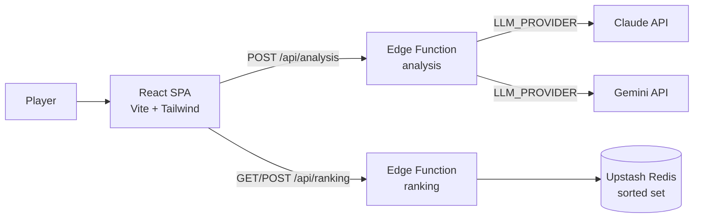

# CCA-F Hunt 🎯

An 8-bit, arcade-style study game for the **Anthropic Claude Certified
Architect (CCA-F)** exam. Pick a tile, answer a real scenario question, and if
you nail it, shoot down a developer's worst enemies (a bug, an HTTP 500, a merge
conflict) to bank the points. At the end you export a personalized study report
with an **AI-generated analysis** of your weak spots.

[](https://github.com/gabipossiderio/anthropic-quiz/actions/workflows/ci.yml)

**▶ Live demo:** https://anthropic-quiz-client.vercel.app

<!-- Add a screenshot or GIF at docs/screenshot.png for the best first impression -->
<!--  -->

---

## Why this project is interesting

It is a fun game on the surface, but under the hood it shows production-minded
**AI engineering** choices:

- **Provider-agnostic LLM layer** — the study analysis runs on **Claude** or
  **Google Gemini**, chosen by an env var (auto-detected). Swapping providers is
  a one-line config change.
- **Resilience by design** — retry with exponential backoff + jitter on
  `429`/`5xx`, and a **graceful offline fallback**: if the LLM (or the whole
  backend) is unavailable, the report is still generated from local rules and
  ships a ready-to-paste "ask Claude" prompt.
- **Secrets stay server-side** — API keys live only in serverless functions; the
  browser never sees them.
- **Abuse protection** — per-IP fixed-window rate limiting on the API, backed by
  Redis, that fails open when Redis is absent.
- **Fully bilingual** (PT/EN) — UI, the 60 real questions, and the report all
  respect the selected language.
- **Tested & CI'd** — Vitest unit tests for the game logic and report generator,
  run on every push via GitHub Actions.

## Architecture



The game itself runs 100% client-side. The two Vercel Edge Functions are the
only backend, and both degrade gracefully when their dependency is missing.

## The AI report flow

1. When the game ends, the client extracts the player's **wrong questions** and
   **weak domains** and calls `POST /api/analysis`.
2. The edge function builds a structured tutor prompt (system + user), then calls
   the configured provider **with retry/backoff**.
3. The returned analysis is embedded into a single Markdown report, alongside a
   per-domain breakdown and a copy-paste prompt for continued study with Claude.
4. If the call fails (quota, network, no key), the report is still produced from
   local rules — the feature never hard-fails.

## Tech stack

- **Frontend:** React 19, TypeScript, Vite, Tailwind CSS v4
- **Backend:** Vercel Edge Functions (Web `Request`/`Response`)
- **AI:** Anthropic Claude / Google Gemini (pluggable)
- **Data:** Upstash Redis (leaderboard as a sorted set)
- **Craft:** synthesized audio (Web Audio API), CSS-keyframe pixel animations,
  self-hosted pixel fonts
- **Quality:** Vitest, oxlint, GitHub Actions CI

## Run locally

```bash
pnpm install
pnpm dev          # http://localhost:5173  (game only)
pnpm test         # unit tests
pnpm build        # typecheck + production build
```

> `pnpm dev` serves the game only — the `/api/*` functions don't run under Vite,
> so ranking and AI show their fallback. To run the functions locally use
> `pnpm dlx vercel dev` (http://localhost:3000) with the env vars set.

Copy `client/.env.example` to `client/.env` and fill in the keys you want.

## Deploy (Vercel)

1. Import the repo and set **Root Directory = `client`** (Vercel auto-detects
   Vite and serves `client/api/*` at `/api/*`).
2. Add the environment variables below and deploy.

| Variable | Used by | Notes |
| --- | --- | --- |
| `LLM_PROVIDER` | analysis | `claude` or `gemini` (auto: claude if the Anthropic key is set) |
| `ANTHROPIC_API_KEY` / `ANTHROPIC_MODEL` | analysis | Claude — [console.anthropic.com](https://console.anthropic.com) |
| `GEMINI_API_KEY` / `GEMINI_MODEL` | analysis | Gemini — [aistudio.google.com](https://aistudio.google.com/app/apikey) |
| `UPSTASH_REDIS_REST_URL` / `UPSTASH_REDIS_REST_TOKEN` | ranking | [console.upstash.com](https://console.upstash.com) |

Every variable is optional: without the AI keys the report falls back to local
analysis; without Redis the leaderboard is simply hidden.

## Project structure

```
client/
├── api/
│   ├── _lib.ts          Shared: Redis client, JSON helper, rate limiter
│   ├── analysis.ts      Edge fn: provider-agnostic study analysis (Claude/Gemini)
│   └── ranking.ts       Edge fn: leaderboard (Upstash sorted set)
└── src/
    ├── data/            60 real questions, PT translations, study tips, config
    ├── game/            State (useQuizGame), audio, report, AI + ranking clients
    │                    (+ *.test.ts)
    ├── components/       Board, QuestionModal, TargetShooter, Podium, ...
    └── i18n.tsx          PT / EN
```

## Roadmap

- Structured LLM output (JSON schema) + streaming preview of the analysis
- Accounts and per-user history
- Difficulty tiers and timed exam mode

## Credits

Built by [Gabriella Possidério](https://www.linkedin.com/in/gabriella-possiderio/).

Questions are sourced from a personal CCA-F practice set for study purposes.
